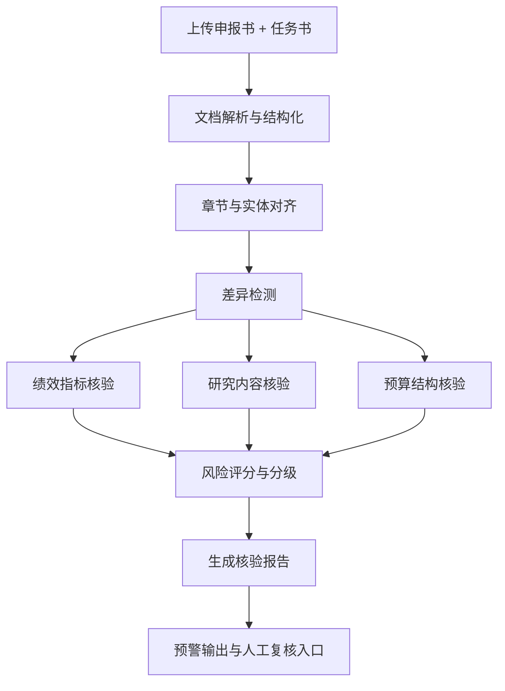

# 📈 绩效核验服务概述

## 服务定位

绩效核验服务用于对同一项目在不同阶段的两份核心材料进行智能对齐与差异核验：

- **申报书**：立项阶段承诺版本
- **任务书**：执行阶段签订版本

服务聚焦识别以下高风险变更：

1. **核心考核指标缩水**：论文/专利/营收/示范应用等目标被下调
2. **研究内容删减**：研究任务、技术路线、里程碑被删除或弱化
3. **预算大类挪移**：设备费、材料费、劳务费、管理费等比例异常变化

目标是把“隐性降标”和“偷工减料”自动显性化，提供结构化预警证据。

---

## 核心能力

### 1. 长文档语义对齐

- 跨章节识别同义标题（如“预期成果” vs “绩效指标”）
- 跨表格/正文统一抽取指标实体
- 处理单位差异（万元/元、篇/项）和时间口径差异（年度/周期）

### 2. 差异分类与风险分级

- 指标差异：数值下调、目标移除、验收标准变宽
- 内容差异：任务删除、关键技术节点缺失、交付件减少
- 预算差异：大类比例偏移、预算结构重排、异常新增/删减

### 3. 可追溯证据输出

- 输出原文定位（章节、段落、表格行列）
- 输出差异说明（旧值、新值、变化幅度、风险等级）
- 输出审查结论（通过/关注/预警）

---

## 业务流程



---

## 模块结构

```text
src/
├── services/
│   └── perfcheck/                    # 绩效核验服务 (50-PerfCheck)
│       ├── __init__.py
│       ├── service.py                # 服务入口
│       ├── agent.py                  # 核验流程编排
│       ├── parser.py                 # 长文档解析
│       ├── aligner.py                # 语义对齐
│       ├── comparator.py             # 差异比对
│       ├── scorer.py                 # 风险评分
│       └── reporter.py               # 报告生成
│
├── common/
│   ├── models/
│   │   └── perfcheck.py              # 数据模型
│   ├── llm/                          # 复用统一 LLM 封装
│   ├── file_handler/                 # PDF/DOCX 解析能力
│   └── tools/                        # 文本与数值处理工具
│
└── app/
    └── routes/
        └── perfcheck.py              # API 路由
```

---

## 技术选型

| 技术 | 用途 |
|------|------|
| LangChain LCEL | 多阶段核验链路编排 |
| 多模态/文本 LLM | 章节语义对齐、差异解释 |
| 规则引擎 | 指标缩水、预算阈值告警 |
| 文本向量检索 | 跨章节同义内容召回 |
| 表格解析工具 | 预算与指标表结构提取 |

---

## 上下游依赖关系

### 上游

- 项目材料上传系统（申报书、任务书）
- 项目元数据（项目编号、年度、类别）

### 下游

- 评审工作台（预警列表、差异详情）
- 审查归档系统（核验报告入库）
- 统计看板（降标率、预算挪移率）

---

## 接口概览

| 接口 | 方法 | 说明 |
|------|------|------|
| `/api/v1/perfcheck/compare` | POST | 执行单项目核验 |
| `/api/v1/perfcheck/batch-compare` | POST | 批量核验 |
| `/api/v1/perfcheck/{task_id}` | GET | 查询任务状态与结果 |
| `/api/v1/perfcheck/{task_id}/report` | GET | 获取结构化核验报告 |

---

## 下游文档

- [规则设计 →](02-rules.md)
- [Agent 设计 →](03-agent.md)
- [文档解析方案 →](04-document-parser.md)
- [API 接口文档 →](05-api.md)