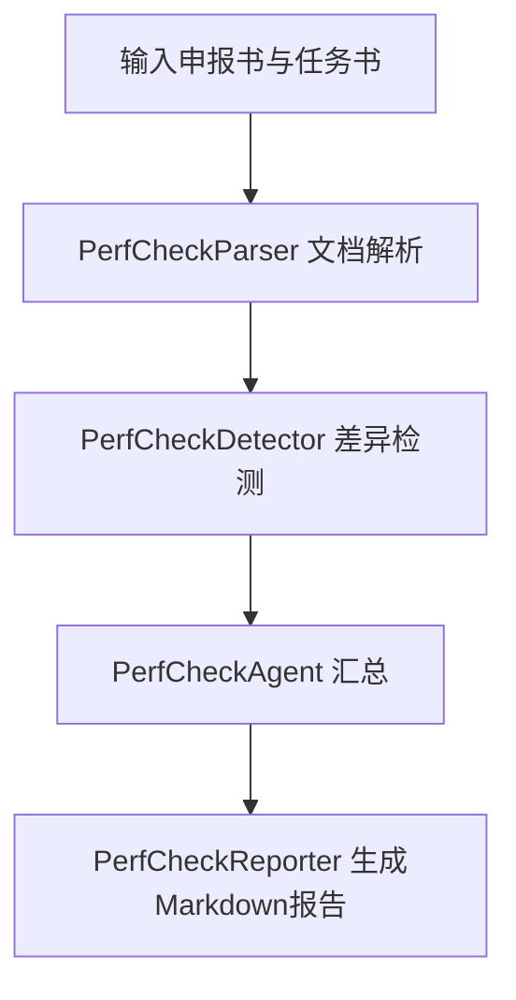

# 绩效核验服务概述

## 服务定位

绩效核验服务用于比对同一项目的申报书与任务书，输出结构化差异结果与审查报告。

当前实现聚焦五类结果：

1. 核心考核指标对齐结果（metrics_risks）
2. 研究内容覆盖结果（content_risks）
3. 预算一致性结果（budget_risks）
4. 单位预算明细结果（unit_budget_risks）
5. 其他关键信息结果（other_risks）

风险等级统一使用 GREEN/YELLOW/RED。

## 当前核心口径

### 核心考核指标口径（metrics_risks）

- 仅比较申报书“五、项目实施的预期绩效目标”与任务书“七、项目实施的绩效目标”章节。
- 抽取顺序固定为：先绩效指标（三级指标+指标值）与满意度，再补总体目标-实施期目标的缺失项。
- 重复项以绩效指标来源优先。

### 项目组成员及分工口径

- 申报书按“项目组主要成员表”章节硬约束抽取（兼容第四/第六部分标题写法）。
- 任务书按“六、参加人员及分工”章节硬约束抽取。
- 报告中输出两侧完整成员与分工列表。

### 预算口径

- 先比较预算总额，再比较预算科目。
- 当预算总额已存在时，预算科目中的“合计/总计”行不再单独出现在 budget_risks 中。

## 执行流程



## 模块结构

```text
src/
├── services/
│   └── perfcheck/
│       ├── service.py       # 对外服务层
│       ├── agent.py         # 编排层（解析+检测+摘要）
│       ├── parser.py        # 结构化抽取（研究/绩效/预算/成员）
│       ├── detector.py      # 差异判定（metrics/content/budget/other）
│       └── reporter.py      # Markdown报告生成
├── common/
│   └── models/perfcheck.py  # PerfCheck数据模型
└── app/
    └── routes/perfcheck.py  # FastAPI路由
```

## 接口概览

| 接口 | 方法 | 说明 |
|------|------|------|
| /api/v1/perfcheck/compare | POST | 同步文件比对 |
| /api/v1/perfcheck/compare-async | POST | 异步文件比对 |
| /api/v1/perfcheck/compare-text | POST | 同步文本比对 |
| /api/v1/perfcheck/compare-text-async | POST | 异步文本比对 |
| /api/v1/perfcheck/{task_id} | GET | 查询任务状态 |
| /api/v1/perfcheck/{task_id}/report | GET | 获取 markdown/json 报告 |

## 核心技术选型

| 技术/组件 | 用途 |
|------|------|
| FastAPI | 提供同步/异步核验接口 |
| Pydantic | 请求与结果模型约束 |
| LLM 客户端 | 语义补抽与对齐精排 |
| 规则后处理 | 章节硬约束、去重与风险判定 |

## 上下游依赖关系

### 上游

- 文件上传入口（申报书/任务书 PDF 或 DOCX）
- 文本直传入口（compare-text）
- 通用文件解析能力（src/common/file_handler）

### 下游

- 审查报告展示（Markdown/JSON）
- debug_pefcheck 调试产物落盘
- 人工复核流程（基于风险结果）

## 关联文档

- [规则设计](02-rules.md)
- [Agent 设计](03-agent.md)
- [文档解析方案](04-document-parser.md)
- [API 文档](05-api.md)