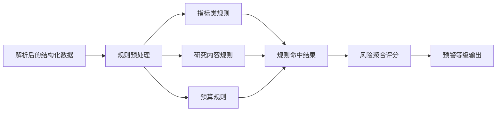

# 📏 绩效核验规则设计

## 设计目标

本规则系统用于将“语义差异”转换为“可判定风险”，确保以下问题可自动识别：

1. 核心指标是否下降
2. 研究内容是否删减
3. 预算结构是否异常迁移

---

## 规则分层

```text
Layer 1: 数据标准化
  - 单位换算、数值清洗、同义词归一

Layer 2: 对齐规则
  - 章节对齐、指标对齐、预算科目对齐

Layer 3: 差异判定规则
  - 指标缩水规则
  - 内容删减规则
  - 预算挪移规则

Layer 4: 风险分级规则
  - Critical / High / Medium / Low
```

---

## 核心规则清单

### 1. 指标缩水规则

#### R-IND-001 数值型指标下降

- 适用对象：论文数、专利数、营收额、样机数量等
- 判定条件：任务书值 < 申报书值
- 风险等级：
  - 下降幅度 >= 30%: `Critical`
  - 10% <= 下降幅度 < 30%: `High`
  - 0 < 下降幅度 < 10%: `Medium`

#### R-IND-002 指标被移除

- 判定条件：申报书存在指标，任务书无对应承诺
- 风险等级：`Critical`

#### R-IND-003 验收口径放宽

- 示例：
  - “发表 SCI 论文 5 篇” -> “发表论文若干”
  - “营收不低于 500 万” -> “形成一定营收”
- 判定条件：可量化约束降级为模糊描述
- 风险等级：`High`

### 2. 研究内容删减规则

#### R-RSCH-001 关键任务删除

- 判定条件：关键研究任务在任务书中缺失
- 关键任务识别：包含关键字“核心技术”“关键算法”“系统集成”“中试验证”等
- 风险等级：`High`

#### R-RSCH-002 里程碑减少

- 判定条件：里程碑数量减少或交付件减少
- 风险等级：`Medium` 至 `High`（按减少比例）

#### R-RSCH-003 技术路线弱化

- 判定条件：任务书中技术路径被替换为低复杂度路线
- 风险等级：`Medium`

### 3. 预算挪移规则

#### R-BUD-001 大类比例异常变动

- 适用大类：设备费、材料费、测试化验加工费、燃料动力费、劳务费、专家咨询费、管理费等
- 判定条件：同一大类比例变化绝对值 > 阈值（默认 15%）
- 风险等级：`High`

#### R-BUD-002 管理性费用异常上升

- 判定条件：管理费/间接费用明显上升且研发类费用同步下降
- 风险等级：`High`

#### R-BUD-003 预算结构重排

- 判定条件：多项预算同时大幅变化，结构相似度低于阈值（默认 0.7）
- 风险等级：`Medium` 或 `High`

---

## 规则执行流程



---

## 核心代码结构

```python
from dataclasses import dataclass
from enum import Enum


class RiskLevel(str, Enum):
    CRITICAL = "critical"
    HIGH = "high"
    MEDIUM = "medium"
    LOW = "low"


@dataclass
class RuleHit:
    rule_id: str
    category: str
    level: RiskLevel
    message: str
    evidence: dict


def check_indicator_decline(declare_value: float, task_value: float) -> RuleHit | None:
    """检查数值型指标是否缩水。"""
    if task_value >= declare_value:
        return None
    decline_ratio = (declare_value - task_value) / declare_value
    if decline_ratio >= 0.3:
        level = RiskLevel.CRITICAL
    elif decline_ratio >= 0.1:
        level = RiskLevel.HIGH
    else:
        level = RiskLevel.MEDIUM
    return RuleHit(
        rule_id="R-IND-001",
        category="indicator",
        level=level,
        message=f"核心指标下降 {decline_ratio:.1%}",
        evidence={"declare": declare_value, "task": task_value},
    )
```

---

## 使用示例

```python
hits = []

hit = check_indicator_decline(declare_value=10, task_value=6)
if hit:
    hits.append(hit)

for h in hits:
    print(h.rule_id, h.level, h.message)

# 输出：R-IND-001 RiskLevel.CRITICAL 核心指标下降 40.0%
```

---

## 可配置参数

| 参数 | 默认值 | 说明 |
|------|--------|------|
| `indicator_decline_critical` | 0.30 | 指标下降 Critical 阈值 |
| `indicator_decline_high` | 0.10 | 指标下降 High 阈值 |
| `budget_shift_threshold` | 0.15 | 预算比例变动阈值 |
| `budget_structure_similarity` | 0.70 | 预算结构相似度阈值 |
| `content_delete_threshold` | 0.20 | 研究内容删减比例阈值 |

---

## 边界与例外处理

- 合理变更（有审批批注、政策调整依据）可标记为“已说明变更”
- 指标单位变化先归一后比较，避免误报
- OCR 不确定字段进入“人工复核队列”，不直接输出高风险结论