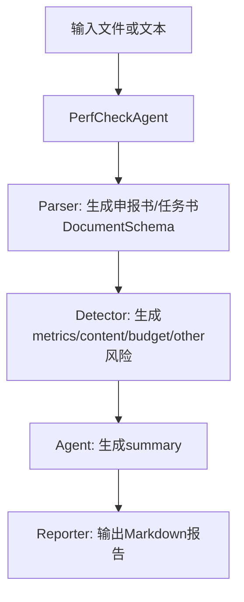

# 绩效核验 Agent 设计

## 设计思路

Agent 采用“解析 -> 检测 -> 汇总”三段式，原因：

1. 解析与检测职责分离，便于定位问题。
2. 同步/异步接口共用同一编排逻辑，减少分叉。
3. 路由层只负责任务状态管理，不承载业务判定。

## 当前编排结构

当前实现是单 Agent 编排，核心组件如下：

1. PerfCheckParser：文档解析与结构化抽取
2. PerfCheckDetector：差异检测与风险判定
3. PerfCheckReporter：Markdown 报告生成

不再区分 aligner/comparator/scorer 独立模块。

## 执行链路



## Agent 关键方法

- run_compare_files：文件流入口（docx/pdf）
- run_compare_text：文本入口
- _execute_detection：统一检测与汇总
- _generate_summary：基于风险项生成摘要

## 核心代码结构

```python
class PerfCheckAgent:
    def __init__(self, budget_shift_threshold: float = 0.10):
        self.parser = PerfCheckParser()
        self.detector = PerfCheckDetector()
        self.budget_threshold = budget_shift_threshold

    async def run_compare_files(self, ...):
        apply_schema, task_schema = await asyncio.gather(
            self.parser.parse_to_schema(declaration_file, declaration_file_type),
            self.parser.parse_to_schema(task_file, task_file_type),
        )
        return await self._execute_detection(project_id, apply_schema, task_schema)
```

## 使用示例

```python
agent = PerfCheckAgent(budget_shift_threshold=0.10)
result = await agent.run_compare_text(
    project_id="demo",
    declaration_text=declaration_text,
    task_text=task_text,
)
print(result.summary)
```

## 进度回调

异步任务支持 on_progress 回调，典型阶段：

1. parse/extract
2. detect
3. summary
4. finalize

路由层将回调结果写入 PerfCheckTask（state/progress/stage/message）。

## 结果模型

Agent 返回 PerfCheckResult，核心字段：

- metrics_risks
- content_risks
- budget_risks
- other_risks
- unit_budget_risks
- summary

## 异常处理策略

- compare-async 与 compare-text-async 在路由层创建后台任务。
- 任务异常统一映射 error_code（如 LLM_TIMEOUT、TASK_CANCELLED、UNKNOWN_ERROR）。
- 同步接口直接抛出 HTTPException。