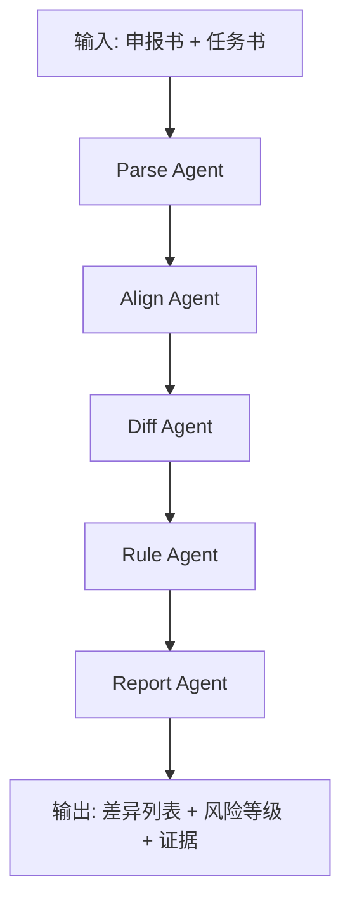

# 🤖 绩效核验 Agent 设计

## 设计思路

绩效核验属于“长文本 + 结构化数值 + 规则解释”的混合任务，采用单一大模型直接比对容易出现遗漏和不可追溯问题。为保证稳定性，采用**分阶段 Agent 编排**：

1. **Parse Agent**：抽取结构化要素
2. **Align Agent**：语义对齐章节与实体
3. **Diff Agent**：生成候选差异
4. **Rule Agent**：规则判定与分级
5. **Report Agent**：证据化报告输出

该架构兼顾可解释性、可测试性和误报可控性。

---

## Agent 流程图



---

## 角色定义

### 1. Parse Agent

- 输入：原始 PDF/DOCX
- 输出：章节树、表格、指标项、预算项
- 要求：保留原文定位坐标（页码、段号、表格位置）

### 2. Align Agent

- 输入：两份文档结构化数据
- 输出：对齐映射（section_map、indicator_map、budget_map）
- 要求：处理同义表达与顺序变化

### 3. Diff Agent

- 输入：对齐映射
- 输出：差异候选（新增/删除/数值变化/语义弱化）
- 要求：区分“实质变化”和“措辞变化”

### 4. Rule Agent

- 输入：差异候选
- 输出：规则命中结果（rule_id、risk_level、reason）
- 要求：严格按规则阈值判定，不做主观扩展

### 5. Report Agent

- 输入：规则命中结果 + 原文证据
- 输出：可读报告（摘要、明细、建议）
- 要求：每条结论必须给出处证据

---

## 提示词策略

### 对齐提示核心要求

- 只做实体映射，不做风险判断
- 优先匹配“指标含义”而非标题字面
- 输出置信度，低置信度进入人工复核

### 差异提示核心要求

- 明确输出旧值与新值
- 对数值项给出变化比例
- 禁止编造不存在字段

---

## 核心代码结构

```python
from typing import Any


class PerfCheckAgent:
    """绩效核验主编排器。"""

    def __init__(self, parser, aligner, differ, rule_engine, reporter):
        self.parser = parser
        self.aligner = aligner
        self.differ = differ
        self.rule_engine = rule_engine
        self.reporter = reporter

    async def run(self, declaration_doc: bytes, task_doc: bytes) -> dict[str, Any]:
        declaration = await self.parser.parse(declaration_doc, doc_type="declaration")
        task = await self.parser.parse(task_doc, doc_type="task")

        aligned = await self.aligner.align(declaration=declaration, task=task)
        diffs = await self.differ.compare(aligned)
        hits = self.rule_engine.evaluate(diffs)

        return self.reporter.build(
            declaration=declaration,
            task=task,
            diffs=diffs,
            rule_hits=hits,
        )
```

---

## 使用示例

```python
agent = PerfCheckAgent(parser, aligner, differ, rule_engine, reporter)
result = await agent.run(declaration_doc=file_a, task_doc=file_b)

print(result["summary"]["overall_risk"])
print(result["summary"]["critical_count"])
```

---

## 可观测性设计

- `trace_id`：全链路追踪
- `stage_cost_ms`：阶段耗时（parse/align/diff/rule/report）
- `llm_calls`：模型调用次数
- `low_confidence_items`：低置信度项数量

---

## 失败恢复策略

- 解析失败：返回可恢复错误并保留可解析片段
- 对齐失败：降级为关键词匹配 + 规则保守判定
- LLM 超时：重试一次，仍失败则进入人工复核队列