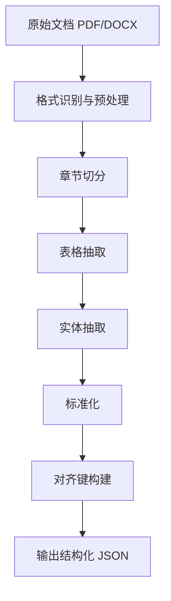

# 📄 文档解析与对齐方案

## 设计思路

申报书与任务书通常篇幅长、版式复杂、表格密集。解析方案采用“结构优先、语义兜底”：

1. 先建立章节树与表格索引，保留文档结构
2. 再抽取指标与预算实体，形成可比对对象
3. 最后通过语义相似度完成跨文档对齐

---

## 解析流程



---

## 关键步骤

### 1. 章节切分

- 识别标题层级（1/1.1/一、（一））
- 构建 `section_id` 与父子关系
- 记录原文位置：页码、段落序号

### 2. 表格抽取

- 提取预算表、绩效指标表、里程碑表
- 对合并单元格做展开归一
- 输出统一行结构：`{category, item, value, unit, period}`

### 3. 实体抽取

- 指标实体：论文、专利、标准、营收、示范、人才培养
- 研究实体：任务、子课题、技术路线、里程碑、交付件
- 预算实体：预算大类、金额、占比、说明

### 4. 标准化

- 单位归一：元/万元、篇/项/套
- 时间归一：年度、项目周期
- 同义词归一：
  - “预期成果”≈“绩效目标”
  - “经费预算”≈“资金计划”

---

## 对齐策略

### 对齐键设计

每个实体生成 `align_key`：

```text
align_key = normalize(name) + normalize(metric_type) + normalize(period)
```

### 对齐顺序

1. 精确键匹配（规则）
2. 同义词匹配（词典）
3. 语义匹配（向量检索）
4. 低置信度人工复核

---

## 核心代码结构

```python
from dataclasses import dataclass


@dataclass
class ParsedEntity:
    entity_type: str
    name: str
    value: float | None
    unit: str | None
    period: str | None
    section_path: str
    page_no: int


def build_align_key(entity: ParsedEntity) -> str:
    """为实体构建跨文档对齐键。"""
    parts = [entity.name.strip().lower(), entity.entity_type]
    if entity.period:
        parts.append(entity.period.strip().lower())
    return "|".join(parts)
```

---

## 使用示例

```python
entities = parser.extract_entities(document_bytes)
entity_keys = [build_align_key(e) for e in entities]

print(len(entities))
print(entity_keys[:3])
```

---

## 质量控制

| 检查项 | 目标 |
|--------|------|
| 章节召回率 | >= 98% |
| 指标抽取准确率 | >= 95% |
| 预算字段完整率 | >= 97% |
| 对齐准确率 | >= 93% |

---

## 异常处理

- 扫描件质量差：启用 OCR 增强并标记低置信度
- 表格断裂：基于标题与邻接行进行拼接恢复
- 单位缺失：根据上下文推断，标注 `inferred=true`