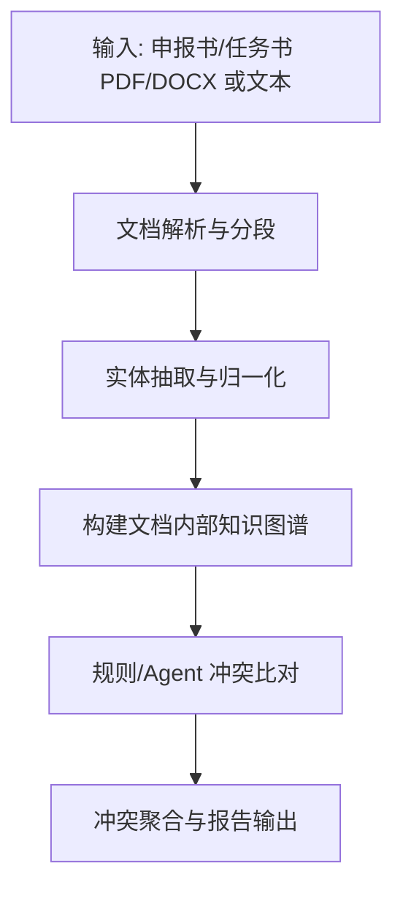

# 全局文档逻辑一致性校验（LogicOn）服务概述

## 服务定位

LogicOn（逻辑自洽）服务用于对单份申报书或任务书进行“全局逻辑一致性”核验，自动发现跨章节的语义或数学逻辑冲突，并输出可定位的冲突点，提示申报人修正或提示审核人重点关注。

典型问题包括：

- 执行期：项目整体执行期为 2 年，但“详细任务进度安排”时间跨度跨越 3–4 年
- 预算：资金申请/下达总额为 50 万，但“资金安排明细”汇总达到 70–100 万
- 指标：总体指标口径与分项指标口径不一致（同一指标在不同章节出现不同目标值/单位/约束）

## 核心能力

- 全文结构化语义解析：将整份文档作为整体进行分段、实体抽取与归一化
- 临时知识图谱构建：在单文档内部建立实体与章节/段落的关联关系
- 冲突比对与定位：对时间、预算、指标、人员等要素进行逻辑一致性校验，输出冲突证据与定位信息
- 可追溯输出：每一条冲突都包含来源片段与字段解释，支持复核

## 执行流程



## 输出结果

输出为结构化的冲突列表：

- 冲突级别：GREEN/YELLOW/RED（可配置阈值）
- 冲突类别：时间/预算/指标/人员/配置 等
- 冲突描述：面向申报人/审核人可读的结论
- 证据：关联的章节、页码（若可得）、原文片段、解析字段

## 与现有模块关系

LogicOn 设计优先复用项目现有能力，避免引入全新范式：

- 复用文件解析能力：`src/common/file_handler`（PDF/DOCX → 文本）
- 复用 LLM 配置与客户端：`src/common/llm`
- 可选复用 perfcheck 的结构化抽取器：`src/services/perfcheck/parser.py`（预算/绩效指标等结构化字段已具备）

## 模块结构（建议）

```text
src/
├── services/
│   └── logicon/
│       ├── service.py        # 对外服务层
│       ├── agent.py          # 编排层（解析+图谱+冲突检测）
│       ├── parser.py         # 全文分段与关键字段抽取（或复用 perfcheck/parser.py）
│       ├── graph.py          # 文档内部图谱构建
│       ├── rules.py          # 规则集合（时间/预算/指标/人员）
│       └── reporter.py       # 报告生成（Markdown/JSON）
└── common/
    └── models/
        └── logicon.py        # 逻辑自洽数据模型
```

## 非目标

- 不做跨文档一致性（申报书 vs 任务书）比对：该能力已由 perfcheck 覆盖
- 不做外部事实校验（联网检索、政策真实性）：仅关注文档内部逻辑一致性
